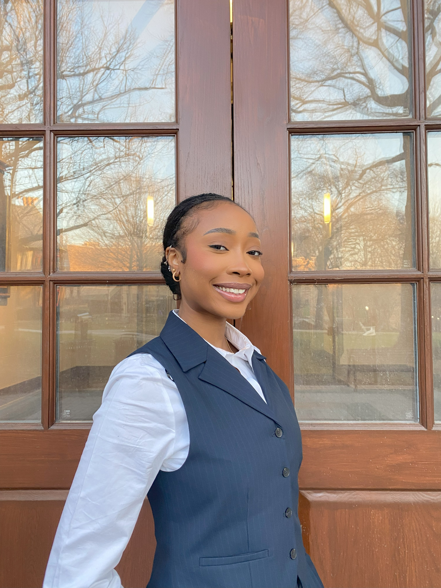

# Legal Risk and Intelligence Analyst

### About Me 

Hello! I am a senior at Loyola University Maryland with deep academic interests and practical exposure to International Business law
With skills in strategic risk analysis, legal research, client support, and case briefing, I am able to conduct legal risk analysis and achieve compliance with federal regulations. I am adept in using the Consolidated Screening List, Westlaw, and Python. 
My analytical skill set, commitment to the legal field and passion for an ethical corporate legal structure make me a valuable asset. In my spare time, I like to play video games and do Pilates. 
You can find me on [LinkedIn](https://www.linkedin.com/in/derin-m-fatungase/)
### Education 
BSc in [Major]
Loyola University, MD

***
### Projects

#### Project 1 Title

 This is a personality test application which I coded using python. This interactive application tasks the users with a series of 10 questions and then corroborates the results from the responses to give users a fun personality type.

 **Initial project Idea:**
I was tasked with the objective to develop an interactive program that composed of a series of questions that prompt a response of the user.I was to program the application to recognize and store the input from the user to categorize the selections of the user into a category that yields that personality type.

**Challenges I faced:**
I found this challenging as I had to develop a code for undesired capitalization or numbers.

**Tools I used:**
 I utilized python as the programming language. To allow the program to run smoothly, I had to insert a code for error checking for each question type. 

 **Result:**
 I accomplished the challenge or error checking by reprompting the user to select only the options provided in the program.

***
#### Project 2 Title
 - Project 1 Summary
 - [insert project 1 screenshot here]
 - Project 1 Report
***
#### Project 3 Title
 - Project 1 Summary
 - [insert project 1 screenshot here]
 - Project 1 Report
