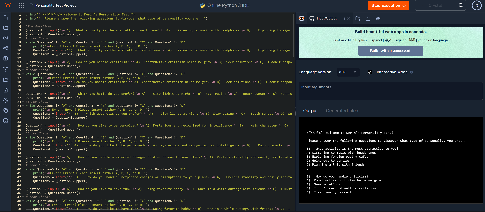

# Legal Risk and Intelligence Analyst

### About Me 

Hello! I am a senior at Loyola University Maryland with deep academic interests and practical exposure to International Business law
With skills in strategic risk analysis, legal research, client support, and case briefing, I am able to conduct legal risk analysis and achieve compliance with federal regulations. I am adept in using the Consolidated Screening List, Westlaw, and Python. 
My analytical skill set, commitment to the legal field and passion for an ethical corporate legal structure make me a valuable asset. In my spare time, I like to play video games and do Pilates. 
You can find me on [LinkedIn](https://www.linkedin.com/in/derin-m-fatungase/)

### Education 

BA in Political Science and Economics
Loyola University, MD

***
### Projects

#### Personality Test Application

 This is a personality test application which I coded using python. This interactive application tasks the users with a series of 10 questions and then corroborates the results from the responses to give users a fun personality type.

 **Initial project Idea:**
I was tasked with the objective to develop an interactive program that composed of a series of questions that prompt a response of the user.I was to program the application to recognize and store the input from the user to categorize the selections of the user into a category that yields that personality type.

**Challenges I faced:**
I found this challenging as I had to develop a code for undesired capitalization or numbers.

**Tools I used:**
 I utilized python as the programming language. To allow the program to run smoothly, I had to insert a code for error checking for each question type. 

 **Result:**
 I accomplished the challenge or error checking by reprompting the user to select only the options provided in the program.

***
#### Health Metrics Indicator
This is a health metrics indicator coded which I programmed using python. This interactive application allows users to insert their height and weight to determine valid suggestions according to HMI data.

 - [insert project 1 screenshot here]
**Initial project idea:**
I was tasked with the objective of programming a health metrics indicator. 

**Tools I used**
I utilized python as the programming language.

**Challenges I faced**
To ensure mathematical validity, I faced the challenge of defining the accurate conversion from pounds to kilograms as a variable for the program to recognize and vis versa the conversion of height from feet to inches.
 
 **Result**
I accomplished this project by simply defining all the variables used in the formulas for both conversions and programmed the application to calculate the users inputs using the accurate variables I inserted.

***
#### Side Business
 This is an Excel spreadsheet I created for a hypothetical personal styling business. All calculations were derived by utilizing excel formulas directly on the spreadsheet to boost efficiency and accuracy of the listed values.

 - [insert project 1 screenshot here]

**Initial project idea:**
I was tasked with the objective to create utilize deliberate formatting, structure and formula for an existing budget I had created for personal stylist which included commercialized products.

**Tools I used**
I used the Microsoft Excel tool to achieve this objective.

**Challenges I faced**
I faced the challenge of enhancing the project by determining the approximate payments that the personal stylist would be required to make on a monthly basis for five, ten, and fifteen years respectively and included a column for interest on the payments based on expected interest rate. 
 
**Result**
I accomplished this by carefully writing down my thought process into mathematical formulas to determine the required payments, I then used excel formulas to calculate the payments directly on the sheet which increased efficiency as opposed to calculating each monthly payment for each product. 

